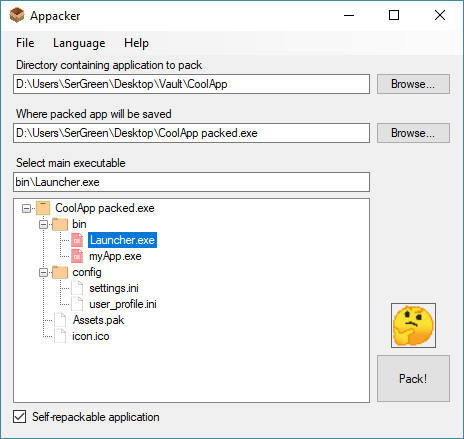

# Appacker
This tool takes a folder with application and packs it into a single executable file (without compression) for easy distribution, portability or whatnot.

## How does it work
The principle behind Appacker is that you can write whatever you want to the end of an `.exe` file and it will still work fine.  
This app simply appends all the necessary files to the end of a wrapper executable and when the wrapper is launched, it extracts all the files from its own `.exe`, places them into a temporary folder and starts packed application. When target app is closed, wrapper removes temp folder.  
  
Also you can set self-repack flag and Appacker will append to the wrapper executable the packer tool, that will repack target application when it's closed from the temporary folder and replace original package with and updated. This can be used to create portable application that saves any changes made to its files (like settings, that are stored inside application directory).  

## How to use Appacker
To pack an application you have to:  
1. Select folder that contains all the files of the target application.  
_You can drag'n'drop the folder to the first textBox or the treeView._
2. Select save location for the package (it must be an `.exe` file).  
_You can drag'n'drop an existing `.exe` into the second textBox; in this case it will be replaced._
3. Select the main executable file of the target application inside the treeView, that will display target application files after the step #1.
4. _[Optional]_ Check the `self-repack` checkbox.
5. Press the `Pack!` button and it's done. It may take some time if the target application is big enough / has a lot of files.

  

## What happens when you run a packed application

  

WIP
