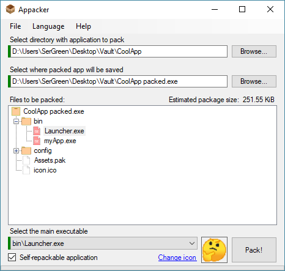
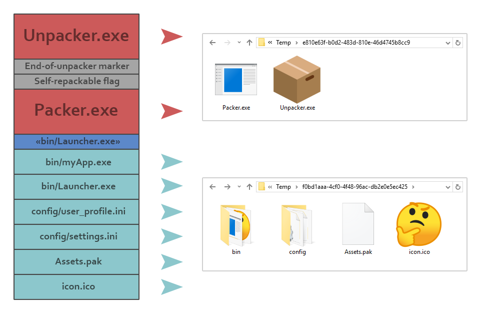

# Appacker
This tool takes a folder with application and packs it into a single executable file (without compression) for easy distribution, portability or whatnot.  

It depends on [Microsoft Visual C++ 2005 Service Pack 1 Redistributable Package](https://www.microsoft.com/download/details.aspx?id=26347) for changing the name of packed application. It will work without VC 2005 Runtime but package name will be "Appacker package".

## KNOWN ISSUE
Appacker and packages created by it **can be detected as malware** by some antivirus software. That's because of a hacky way i used to package files: **packed app reads its own executable and extracts other files from it**, which antiviruses find hella suspicious. It's **false positive**, but it still gets in the way of using this app. I **can't fix this**, which renders this app **not very useful**. ¯\\\_(ツ)\_/¯

Still want to download it for some reason? Well, here you go then: __[Download the latest version](https://github.com/SerGreen/Appacker/releases/latest)__.

## Usage
To pack an application you have to:  
1. Select a folder that contains all the files of the target application.  
_You can drag'n'drop the folder to the first textBox or the treeView._
2. Select save location for the package (it must be an `.exe` file).  
_You can drag'n'drop an existing `.exe` into the second textBox; in this case it will be replaced by the package._
3. Select the main executable file of the target application inside the treeView, it will display target application's files after the step #1.
4. [Optional] Check the `self-repackable` checkbox.
5. Press the `Pack!` button and it's done. It may take some time if the target application is big enough / has a lot of files.

<p align="center">
  
</p>

### How to use Appacker via command line
It can be used in GUI-less mode via command line. If you provide no arguments it will launch GUI.

```console
Usage: appacker.exe [-r] [-q] <-s "source_folder"> <-e "main_exe"> [-d "save_location"] [-i "icon_path"]

Options:
  -s, --src, --source-folder=VALUE
                             Directory containing all the files of the target
                               application.
  -e, --exe, --main-exe=VALUE
                             Local path to the main executable inside the
                               source app folder. This is the application that
                               will launch whenever the packed app extracts
                               itself.
  -d, --dst, --destination, --output=VALUE
                             Location where packed app will be created.
  -i, --ico, --icon=VALUE    Custom icon for the packed application.
  -r, --repack, --self-repack
                             Sets the packed application to refresh itself
                               after the main executable closes. Refreshing
                               adds and replaces files in the packed executable
                               with those created and modified during runtime.
  -q, --quiet, --silent      No progress messages will be shown during the
                               packing process.
  -h, --help, -?             Show this message and exit.
```


This will launch Appacker in GUI mode:
```console
C:\>appacker.exe
```
This will launch Appacker in console mode:
```console
C:\>appacker.exe -r -src "d:\users\sergreen\desktop\vault\coolapp" -exe "bin\launcher.exe" -dst "d:\users\sergreen\desktop\vault\CoolApp packed.exe" -ico "d:\cool_icon.png"
```
You can also run it in silent mode by adding `--quiet` flag, in this mode only error messages are shown.

## How does it work
The principle behind Appacker is that you can write whatever you want to the end of an `.exe` file and it will still work fine.  
This app simply appends all the necessary files to the end of a wrapper executable and when the wrapper is launched, it extracts all the files from its own `.exe`, places them into a temporary folder and starts extracted application. When target app is closed, wrapper removes temp folder.  
  
Also you can set self-repack flag and Appacker will append to the wrapper executable the packer tool, that will repack target application once it's closed from the temporary folder and replace the original package with the updated one. This can be used to create portable application that can keep any changes made to its files (like settings, that are stored inside application directory).  

## What happens when you run packed application

<p align="center">
  
</p>

Packed application is in fact an `unpacker.exe` with appended files. Application's lifecycle differs a bit for self-repackable and regular packages.  
For the example, let's take the `CoolApp.exe` package from the screenshot above and see what it does when launched.

__If it's NOT a self-repacking application, CoolApp.exe does the following:__
1. Creates a temporary folder for the target application files in `C:\Users\%UserName%\AppData\Local\Temp`
2. Extracts all the appended files from its own `exe` into the temp folder
3. Runs the main executable of the extracted app (for `CoolApp.exe` it's `Launcher.exe`) and waits for it to finish
4. Deletes the temporary folder and quits

__If it is a self-repacking application, CoolApp.exe does the following:__
1. Creates a temporary folder A for the target application files in `C:\Users\%UserName%\AppData\Local\Temp`
2. Creates a temporary folder B for the `packer.exe` and `unpacker.exe` tools
3. Extracts `packer.exe` and `unpacker.exe` from its own `exe` into the temp folder B
4. Extracts all the appended files from its own `exe` into the temp folder A
5. Runs the main executable of the extracted app (for `CoolApp.exe` it's `Launcher.exe`) and waits for it to finish
6. Launches the `packer.exe` from temp folder B and quits
7. Packer takes all the files from the temp folder A and packs them into a new package. New package replaces the original `CoolApp.exe`
8. Packer deletes the temp folder A
9. Packer launches new `CoolApp.exe` with the special flag `-killme` and asks it to delete the temp folder B (because `packer.exe` can't delete itself); packer quits
10. New `CoolApp.exe` deletes temp folder B and quits

## Solution structure
* `Appacker` &mdash; WinForms main application project
* `Packer` &mdash; Console tool that creates packages
* `Unpacker` &mdash; Console wrapper that is used as the core of a package
* `ProgressBarSplash` &mdash; WinForms splashscreen tool, that is used by packer and unpacker tools
* `IconLib` &mdash; DLL project for saving Windows `.ico` files (vanilla .NET can't save Windows icons correctly ¯\\\_(ツ)\_/¯ )
* `IconInjector` &mdash; DLL project for replacing icons of external executables

## Dependencies and credits
* [IconLib by Gustavo Franco](https://www.codeproject.com/Articles/16178/IconLib-Icons-Unfolded-MultiIcon-and-Windows-Vista) &mdash; Library for work with windows `.ico` images.
* [IconInjector by 'some chinese guy'](https://hackforums.net/showthread.php?tid=1021081) &mdash; Library for injecting icons into external executables.
* [Fody.Costura by Simon Cropp](https://github.com/Fody/Costura) &mdash; NuGet package for embedding .exe and .dll files into the main executable.
* [Resource.Embedder by MarcStan](https://gitlab.com/MarcStan/Resource.Embedder) &mdash; NuGet package for embedding localization satellite assemblies into the main executable.
* [CultureManager by Grant Frisken](https://www.codeproject.com/Articles/23694/Changing-Your-Application-User-Interface-Culture-O) &mdash; WinForms component that allows dynamically update language and UI Culture of the form without closing and recreating it.
* [XDMessaging by TheCodeKing](https://thecodeking.co.uk/project/xdmessaging/usage/) &mdash; Lightweight easy-to-use library for inter-process communication.
* [CueProvider by Ravi Bhavnani](https://www.codeproject.com/Articles/27853/CueProvider) &mdash; Lightweight class that lets you add cue banners to a TextBox.
* [NDesk.Options](http://www.ndesk.org/Options) &mdash; NuGet package for parsing program arguments.
* [VerInfoLib by Denis Zabavchik](https://www.codeproject.com/Articles/13355/Modification-of-Version-Information-Resources-in-C) &mdash; Library that provides an easy way to read, modify, and save version information resource(s) (RT_VERSION) in compiled executable modules (EXE, DLL, OCX, SCR etc.).
* [ini-parser by rickyah](https://www.nuget.org/packages/ini-parser) &mdash; NuGet package for reading/writing INI data from IO streams, file streams, and strings.
